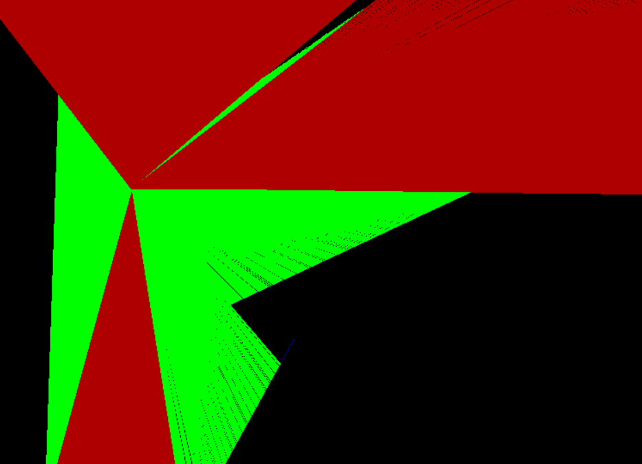
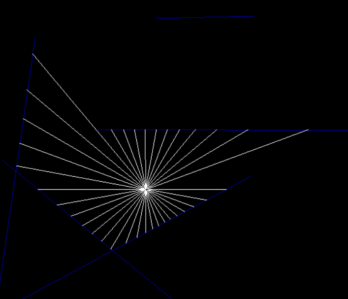
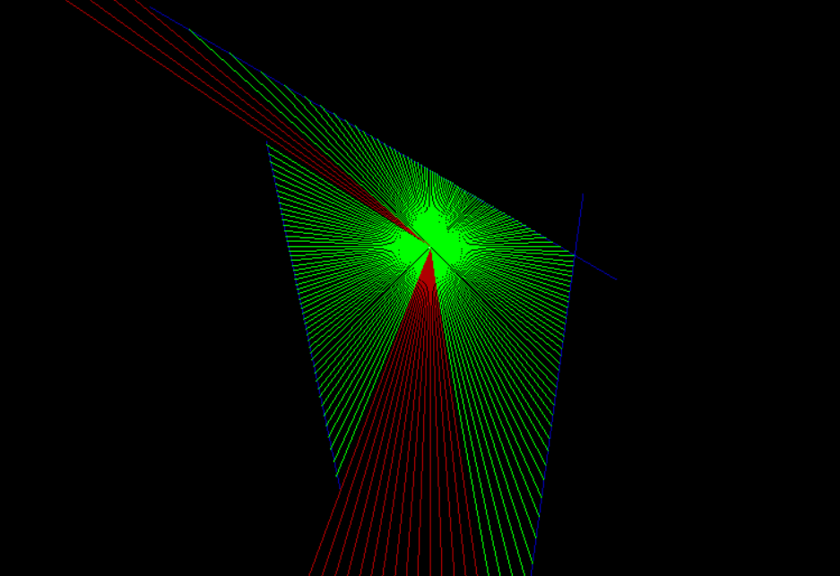
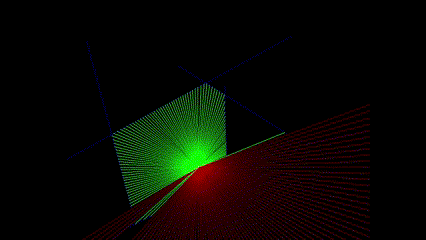
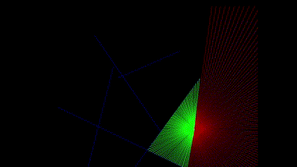

# 2D-RayCast
PyGame-based visualization for 2D RayCaster








## overview
The next sections explain the mathematical concepts behind ray casting and how it works in 2D.
For installation and getting this running on your machine scroll down

## Basic Concept
Ray casting is a technique used in computer graphics and computational geometry to project rays from a point (usually representing the position of an observer or a light source) into a scene to determine the visibility of objects, calculate intersections, and simulate various optical effects.


The basic idea of ray casting involves tracing the path of rays from a specific origin point in a particular direction through a scene. Each ray continues until it intersects with an object in the scene or reaches a maximum distance. The intersections of these rays with objects can then be used for various purposes, such as:

- **Visibility Determination**: Determining which objects or parts of objects are visible from a certain viewpoint.
- **Shadow Casting**: Calculating shadows by tracing rays from light sources to surfaces.
- **Collision Detection**: Determining if and where a moving object intersects other objects.

## Applications

Ray casting is used in many areas, including:

1. **Computer Graphics**: Ray casting is a fundamental part of ray tracing, a rendering technique used to generate photorealistic images by simulating the way rays of light interact with surfaces.
2. **Game Development**: Used for line-of-sight calculations, AI vision, and more.
3. **Physics Simulations**: Determining paths of particles and waves, calculating reflections and refractions.
4. **Robotics**: Helping robots understand their environment by simulating sensors like LIDAR.

## Steps in Ray Casting

1. **Ray Generation**: Rays are generated from the origin point in specific directions. In graphics, these rays are often generated per pixel in the image plane.
2. **Intersection Calculation**: For each ray, the algorithm checks for intersections with objects in the scene.
3. **Ray visualization**: After an intersection is found the rays are visualized to show the collision points 

## Example

Consider a simple 2D example where we want to determine which parts of a scene are visible from a given point:

1. **Generate Rays**: Rays are cast from the observer's position in various directions.
2. **Check Intersections**: Each ray is checked for intersections with objects in the scene.
3. **Determine Visibility**: If a ray intersects an object, that part of the object is considered visible.

## Pygame Implementation

In this Pygame implementation of ray casting, we start by setting up a black screen and then casting rays from the player's position to determine visibility and render the scene accordingly. 

# Calcualtions

Consider a particle located at a point $(P_x, P_y)$ with a ray that has an angle $\theta$. We aim to calculate the endpoint of this ray by determining the direction vector based on the angle and adding it to the start point.

The direction vector $\mathbf{v}$ for a given angle $\theta$ can be calculated using trigonometric functions:

$ \mathbf{v} = (\cos(\theta), \sin(\theta)) $

If we want the ray to have a specific length $L$, we scale the unit direction vector:

$ \mathbf{v} = (L \cdot \cos(\theta), L \cdot \sin(\theta)) $

The endpoint $(E_x, E_y)$ of the ray from the starting point $(P_x, P_y)$ can be found by adding the direction vector to the start point:

$ (E_x, E_y) = (P_x + L \cdot \cos(\theta), P_y + L \cdot \sin(\theta)) $

## Line Intersection

Now, let's determine the intersection of this ray with a wall represented by the line segment between points $(X_1, Y_1)$ and $(X_2, Y_2)$.

The ray from $(P_x, P_y)$ in the direction $\mathbf{v}$:

$ \mathbf{r}(t) = (P_x + t \cdot v_x, P_y + t \cdot v_y) $

The line segment from $(X_1, Y_1)$ to $(X_2, Y_2)$:

$ \mathbf{l}(u) = (x1 + u \cdot (x2 - x1), y1 + u \cdot (y2 - y1)) $

### Finding the Intersection

The intersection occurs when:

$ P_x + t \cdot v_x = x1 + u \cdot (X_2 - X_1) $ &
$ P_y + t \cdot v_y = y1 + u \cdot (Y_2 - Y_1) $

This can be written as a system of linear equations:

$ P_x + t \cdot (E_x - P_x) = x1 + u \cdot (x2 - x1) $

$ P_y + t \cdot (E_y - P_y) = y1 + u \cdot (y2 - y1) $

Solving for $t$ and $u$ yields:

$ t = \frac{(x1 - P_x)(y1 - y2) - (y1 - P_y)(x1 - x2)}{(E_x - P_x)(y1 - y2) - (E_y - P_y)(x1 - x2)} $
$ u = \frac{(x1 - P_x)(y1 - P_y) - (y1 - P_y)(x1 - P_x)}{(x1 - x2)(y1 - P_y) - (y1 - y2)(x1 - P_x)} $

For the intersection to be valid:
- $0 \leq u \leq 1$: The intersection point lies within the segment.
- $t \geq 0$: The intersection point lies on the ray extending from the particle.

If these conditions are met, the intersection point $(I_x, I_y)$ is:

$ (I_x, I_y) = (P_x + t \cdot v_x, P_y + t \cdot v_y) $

# Installation

### Prerequisites

- Python 3.x

## Installation

1. Clone the repository
2. Navigate to the project directory

### Installing Required Libraries

This simulation uses Pygame for visualization and Numpy for vectorization. If you haven't installed Pygame or Numpy yet, you can install them using pip. Open your terminal and run the following command:

```sh
pip install pygame numpy
```

### Running the simulation

To run the simulation, run `main.py`
```sh
python main.py
```
this should start a pygame window where you can move the particle by moving the mouse, change the environment by using mouse buttons and increasing/decreasing the number of rays via scroll wheel
